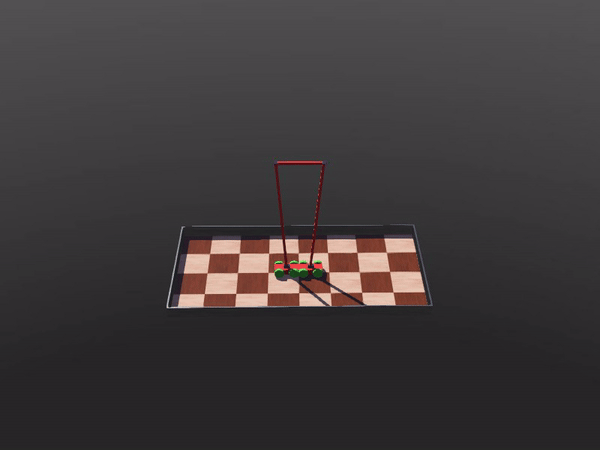
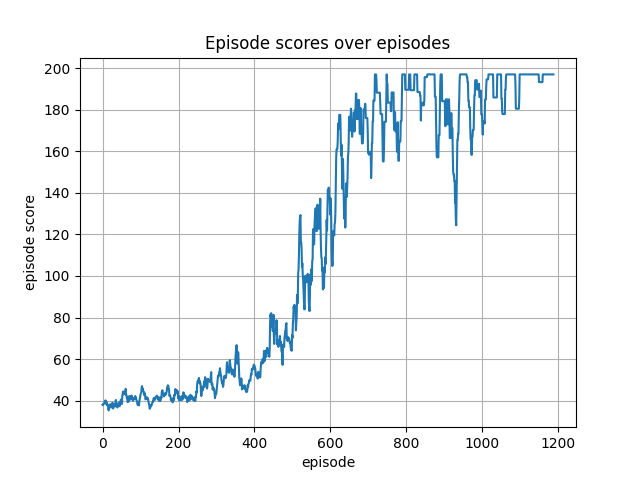

# DoubleCartPole

This example extends the classic [CartPole](https://gymnasium.farama.org/environments/classic_control/cart_pole/) problem by simulating a Double CartPole environment in [Webots](https://cyberbotics.com), with both carts interacting in a shared environment, showcasing a multi-agent reinforcement learning approach.

[PyTorch](https://pytorch.org/) is used as the backend neural network library. 

The solution uses discrete action spaces, with each cart-pole agent applying discrete forces to balance the poles. The implementation provided is using a custom [Proximal Policy Optimization Reinforcement (PPO) Learning (RL) algorithm](https://openai.com/blog/openai-baselines-ppo/), and the emitter-receiver scheme ([supervisor script](./controllers/supervisor_manager/supervisor_controller.py), [robot script](./controllers/robot_controller/robot_controller.py)).

This setup highlights the flexibility of the deepbots framework in multi-agent environments.

You can find the corresponding .wbt world files to open in Webots [here](./worlds/).

----

### Contents
- [supervisor](./controllers/supervisor_manager/supervisor_controller.py), [robot](./controllers/robot_controller/), [custom PPO](./controllers/supervisor_manager/agent/PPO_agent.py)

----

### Showcase of trained PPO agents

Trained agent in action:

Reward per episode plot:

